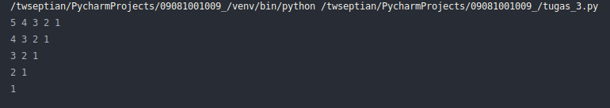
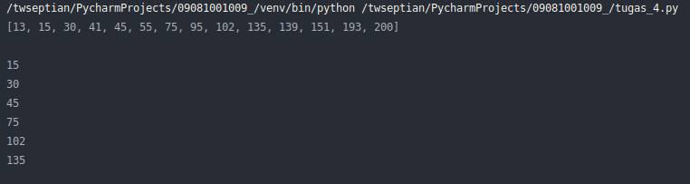

# Tugas Mandiri - Praktikum Algoritma & Pemrograman

Silahkan anda kerjakan tugas mandiri sebagai berikut:
1. Buat program dengan menampilkan sebuah permainan: Gunting, Batu, Kertas. seperti pada output video berikut (klik play button video tersebut):

[](https://asciinema.org/a/e8P0MH8rpfZWhjmtXqhTyY7ow)


2. Buat program dengan menghitung jumlah karakter huruf dan angka pada sebuah string, dengan memanfaatkan function `isdigit` dan `isalpha`, berikut sebagai contoh:

```
inputan = input("Inputan: ")
angka = 0
for x in inputan:
    if x.isdigit():
        angka=angka+1

print("Jumlah Angka: ", angka)
```

ketika dijalankan akan menampilkan output sebagai berikut:

[](https://asciinema.org/a/nRIu3jc0vNqWz4LRrTBJaxVut)

Sebagai catatan, untuk menghitung jumlah karakter huruf, silahkan anda gantikan `isdigit` pada source code di atas dengan `isalpha`. 

**Task:** Tugas anda adalah menggabungkan `isdigit` dan `isalpha` dalam menghitung sejumlah karakter angka dan huruf, seperti pada output video di bawah

[](https://asciinema.org/a/rv2dZkUY9vRYwD4EvkB2g9zxP)


3. Buat program tampilan output berikut:



4. Buat program yang menampilkan output list yang habis di bagi oleh 3 dan tidak boleh menampilkan lebih dari 151 dari list berikut: 

`list1 = [13, 15, 30, 41, 45, 55, 75, 95, 102, 135, 139, 151, 193, 200]`

