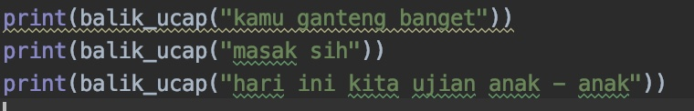
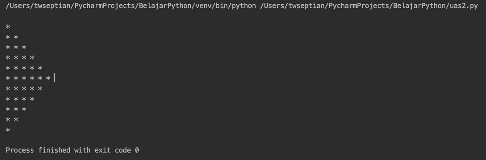

# Ujian Akhir Semester - Praktikum Algoritma & Pemrograman

Silahkan anda kerjakan soal dan pertanyaan  sebagai berikut:

1. Buat lah program dengan menampilkan kalimat yang dibalik, misalkan inputannya sebagai berikut **(20 points)**:
<br>**Input**<br>

<br>**Output**<br>


2. Buat lah program dengan menampilkan bintang segitiga seperti pada output dibawah **(30 points)**:


3. Buatlah program kasir di sebuah kantin, dengan kondisi **(50 points)**:
    
    1. list opsi pilihan makanan dan aksi, bisa anda gunakan dalam format dictionary dalam source code anda, seperti di bawah.
    ```
    food = [["BU", "Bakso Urat", 15000, 0], ["MA", "Mie Ayam", 12000, 0], ["NG", "Nasi Goreng Ayam", 12000, 0], ["ET", "Es Teh", 4000, 0], ["AG", "Ayam Goreng", 10000], ["AGK", "Nasi Ayam Geprek Kriuk", 15000, 0]]
    ```
    **Output opsi pilihan**
    [](https://asciinema.org/a/jv0798wSXYY6LtIba2XLFrEBG)

    2. untuk aksi ketika sudah selesai pilih makanan antara lain terdiri dari laporan ke kasir untuk melihat struk harga, dan selesai memesan, untuk outputnya dapat anda lihat di bawah:

    [](https://asciinema.org/a/l6IuRMMTt9DvoaaCRY70dFZIM)

    **Tambahan** jika uang bayaran konsumen tidak cukup maka akan diulangi lagi sampai uang nya cukup

    [](https://asciinema.org/a/ybYQDVOCnTkyPYQkvsZXig422)

