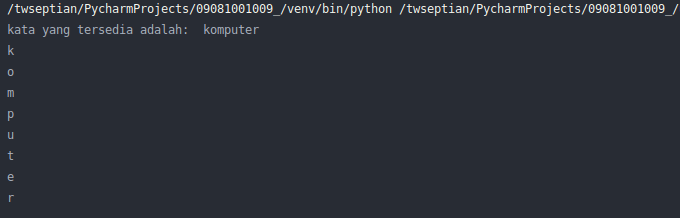
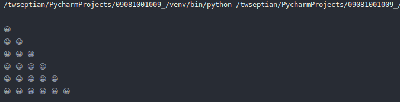
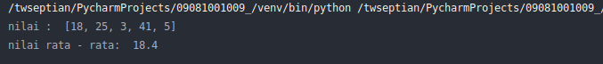

# Ujian Tengah Semester - Praktikum Algoritma & Pemrograman

Silahkan anda kerjakan soal dan pertanyaan  sebagai berikut:

1. Buat program dengan menampilkan sebuah string, misalkan `komputer` dan akan ditampilkan seperti pada gambar output **[POIN: 10]**

2. Buat program dengan menampilkan sebuah perulangan piramida dengan menampilkan karakter emoji smile `\U0001f600` , seperti output yang ditampilkan di bawah **[POIN: 10]**

untuk program ketika dijalankan,

3. Buat program dengan menampilkan nilai rata - rata, dari list bilangan yang ditampilkan seperti pada output gambar **[POIN: 20]**

4. Buat program dengan menampilkan nilai median dari tiga bilangan, dengan penjelasan sebagai berikut, misalkan ada 3 bilangan, secara acak `23, 65, 12` maka jika di urutkan dari nilai terendah ke terbesar menjadi `12, 23, 65` dan nilai mediannya adalah `23` **[POIN: 20]**

5. Buatlah program mesin ATM dengan menampilkan menu awal, permintaan untuk `informasi saldo`, `penarikan tunai`, `simpan/tabung uang`, `menu keluar` untuk masuk ke menu sistem ATM, anda masukkan pin terlebih dahulu (untuk pin, silahkan modifikasi sesuai dengan keinginan anda), untuk program lengkapnya, silahkan lihat video berikut: **[POIN: 40]**

